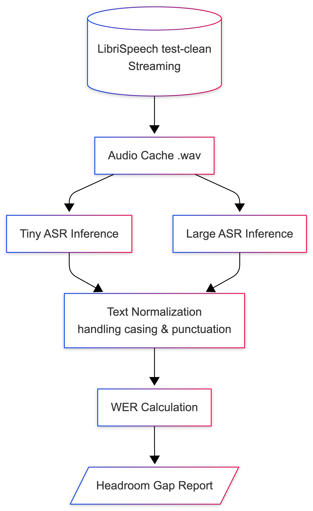
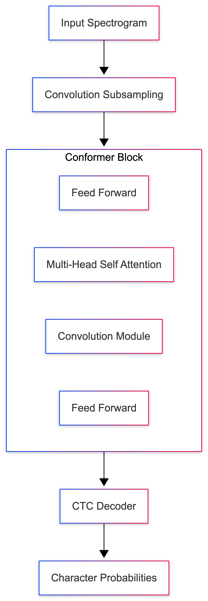
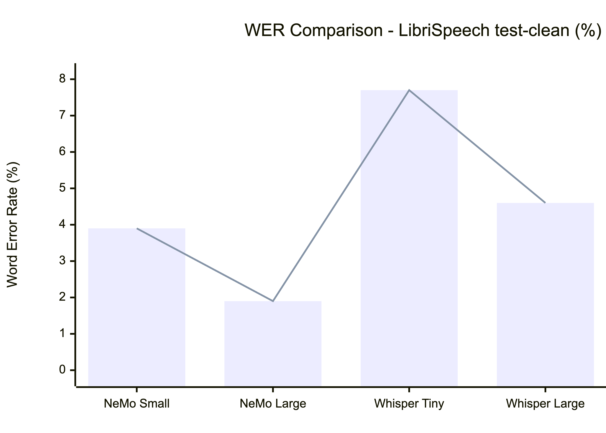
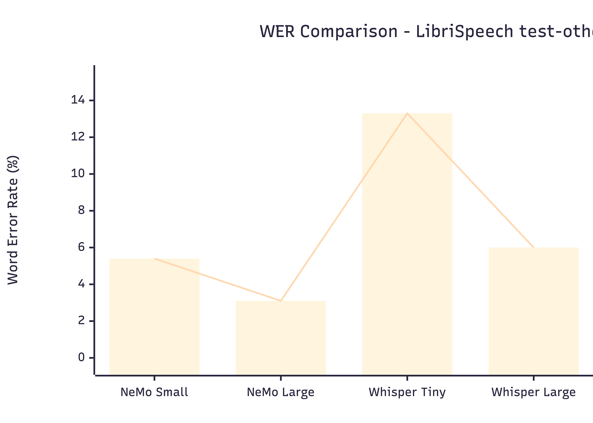

# Tiny ASR Research: Exploring Capacity Limits & LLM Correction

## Overview

This repository contains research aimed at improving the performance of small Automatic Speech Recognition (ASR) models. The core idea is that while tiny ASR models (around 10M-50M parameters) suffer from a higher Word Error Rate (WER) due to model capacity limits, a similarly small "Tiny LLM" can be used to correct the ASR outputs. The project is written in Python, leveraging PyTorch, the Hugging Face ecosystem, and NVIDIA's NeMo toolkit.

## How it works

Here is the data flow of the profiling and evaluation pipeline:

The pipeline streams audio samples, passes them through targeted ASR models, normalizes the text outputs (handling punctuation and casing), and calculates the Word Error Rate (WER) against the ground truth reference text.

## Model Profiling & "The Headroom Hunt"

To justify the Tiny ASR + Tiny LLM approach, the system first profiles existing state-of-the-art models on the `LibriSpeech test-clean` dataset to identify the performance "gap" between small and large variants of the same architecture.

The evaluation targets two primary model families:

1. **NVIDIA NeMo Conformer**: Comparing `stt_en_conformer_ctc_small` (~13M parameters) against its larger counterpart.

2. **OpenAI Whisper**: Comparing `whisper-tiny` (39M parameters) against `whisper-large-v3`.

By establishing the baseline failure scenarios of the small models where the large models succeed, we define the potential "headroom" that our Tiny LLM will attempt to recover.

## Performance

The project relies on `jiwer` to record evaluation statistics. The metrics track:

* Word Error Rate (WER) %
* Model Parameter Count
* Inference Time / Sample

## Experience

I chose to build this evaluation pipeline using standard, industry-grade tools (`transformers`, `datasets`, `nemo_toolkit`) to ensure reproducibility and easy integration with future training workflows. Handling the datasets via streaming directly from Hugging Face significantly sped up the initial development cycle compared to downloading the entire dataset locally.

Although the current pipeline successfully profiles the ASR headroom, the immediate future enhancement is to integrate the Tiny LLM component. I plan to explore sequence-to-sequence (Seq2Seq) model designs and training procedures to build the error-correction layer on top of these profiled ASR outputs. Additionally, expanding the evaluation to noisier datasets like `LibriSpeech test-other` will help identify more robust failure scenarios.

Below is a summary of the pros and cons of the current profiling system.

### Pros

* Fast experimentation via dataset streaming (`streaming=True`) rather than full downloads
* Handles model-specific quirks gracefully (e.g., dynamically caching streamed audio arrays to `.wav` files on disk for NeMo compatibility)
* Robust text normalization ensures fair WER comparisons between models that output punctuation (Whisper) and those that don't (NeMo)
* Clear, quantifiable metrics that successfully isolate model capacity limits from data issues

### Cons

* Streaming requires local disk caching for certain toolkits (like NeMo), creating a slight I/O bottleneck
* Evaluating the full `test-clean` split (2,600+ samples) is highly time-consuming on a single GPU
* Currently relies strictly on WER, lacking deeper linguistic analysis of *why* specific words failed (e.g., homophones vs. acoustic noise)